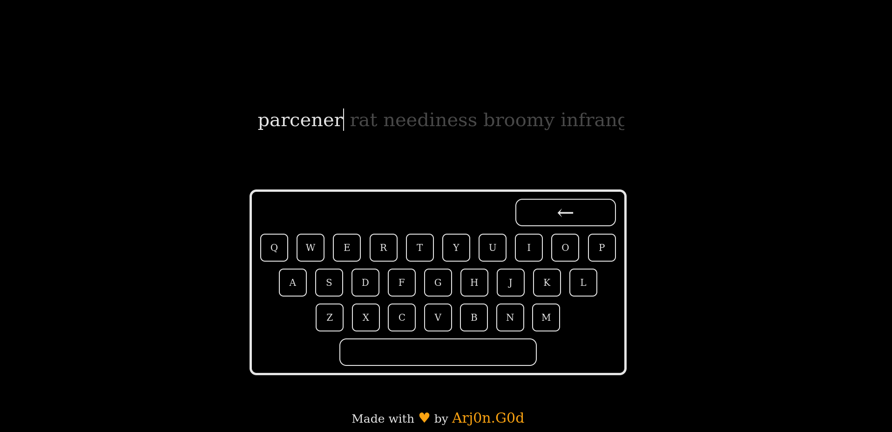

# TYPI - Minimalistic Typing Challenge

TYPI is a minimalistic typing game designed to improve your typing speed and accuracy. The game challenges you to type randomly generated words and calculates your average and maximum words per minute (WPM). It provides a clean and simple interface, making it perfect for typing practice on a PC or laptop.

## 🚀 Features

- **Random Word Generation**: Press "Enter" to start typing a random set of words.
- **Typing Speed**: Calculates both average and maximum typing speed in words per minute (WPM).
- **Accuracy Feedback**: Marks correct and incorrect keypresses with visual feedback.
- **Customizable Keyboard Interface**: Displays an on-screen keyboard highlighting the pressed keys.
- **Responsive Visual Effects**: Smooth transitions for keys and game results.
- **Cross-browser Compatible**: Runs smoothly across modern web browsers on PC/laptop screens.

## 🎮 How to Play

1. Open the website on your PC/laptop (Mobile version is not supported).
2. Wait for the "TYPI" animation, followed by the start screen.
3. Press "Enter" to start the game.
4. Begin typing the displayed words as quickly and accurately as you can.
5. Use **Backspace** to correct any mistakes.
6. After completing the words, your results will display:
   - **Average WPM**: Your average typing speed.
   - **Maximum WPM**: The fastest typing speed you achieved during the session.

## 💻 Tech Stack

- **HTML**: Structuring the game interface.
- **CSS**: Styling the keyboard, typing area, and result screen.
- **JavaScript**: Implementing the game logic, key detection, and result calculations.
- **Axios**: Fetching random words from an API.
  
## Demo

### TYPI Animation

### Start Screen

### In-Game

### Result Screen
